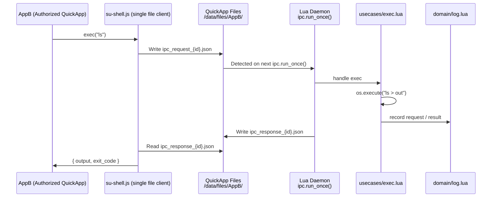
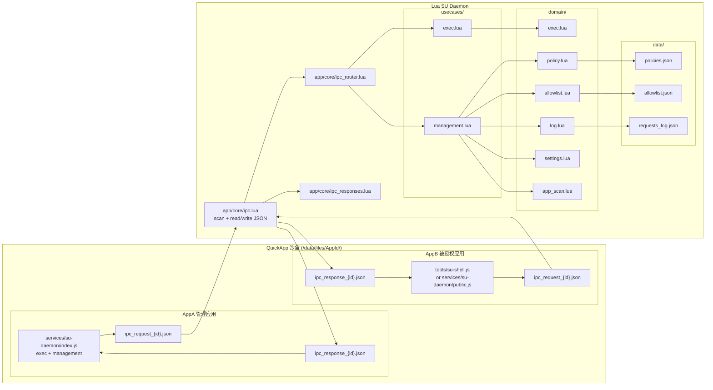
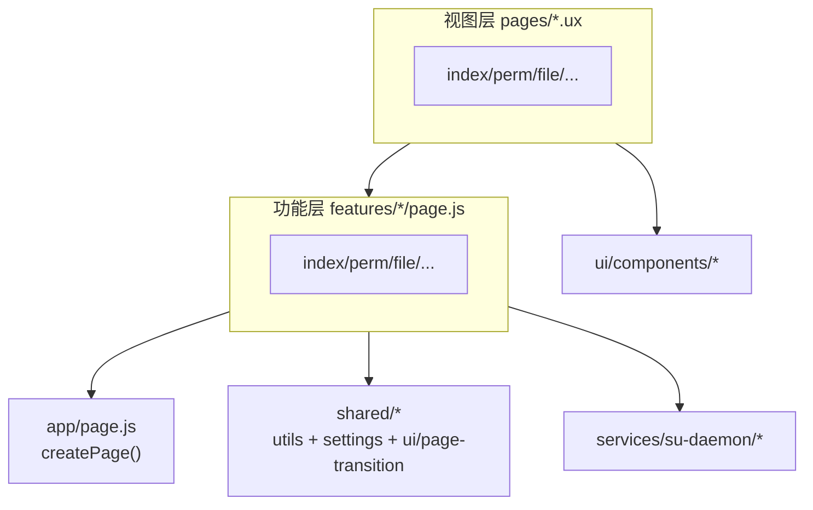

## 项目介绍

Vela-Shell-Bridge 是一个为小米VelaOS穿戴设备设计的 QuickApp → Lua → Shell 执行桥接层。
它允许普通快应用，在严格的权限策略下，通过 Lua 守护进程执行系统级 Shell 命令。

- 文件 IPC 作为通信通道
- Lua 守护进程负责执行与回显
- JS 侧提供 su-daemon 客户端与授权应用单文件脚本
- 支持权限管理、执行日志、白名单
- 可在手表和 PC 模拟器运行

这是一个能让 QuickApp 执行系统命令 的受控提权模块。

## 目标设备 Shell 特性（NuttX / `emulator-5554`）

通过 `adb -s emulator-5554 shell` 实测：目标环境的 `sh` 更接近“精简脚本解释器”，很多常见 shell 特性不可用。

- 支持：换行/`;` 分隔、stdout 重定向 `>`/`>>`、后台 `&`（命令行尾）、`$!`、`if/then/else/fi`
- 不支持：`|`/`||`/`&&`、fd 重定向 `2>`、`grep/head/tail` 等常见工具、常见变量 `$?` `$$` `$1`...
- 注意：`$!` 会在后续命令后变化，必须立即保存；`if` 的条件里不要写 `cmd1; cmd2`（会触发 `echo: not valid in this context`）

因此异步 exec 的完成态 `exit_code` 采用 `-1` 表示“未知”（kill 为 `137`）。同步 exec 仍能返回真实 exit code。

可以用 `tools/probe-shell.ps1` 复现这套探测（默认 `emulator-5554`）。

## 开发文档

[Lua表盘应用文档](https://github.com/FangAiden/Lua_Watchface_Documentation)
[Vela JS 快应用文档](https://iot.mi.com/vela/quickapp/)

## 授权应用接入

被授权应用可直接拷贝 `tools/su-shell.js` 使用 `exec/execSync/kill` 调用 Shell。
主应用使用 `src/services/su-daemon/index.js`（含管理接口），只需 exec 可参考 `src/services/su-daemon/public.js`。

## 流程图

## 架构图1（系统）

## 架构图2（JS 侧）

