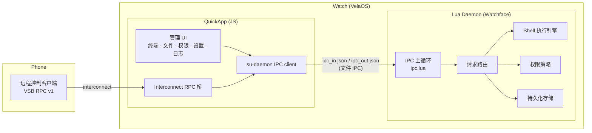

# Vela-Shell-Bridge

小米 VelaOS 智能手表上的**权限管控 Shell 执行桥**。允许 QuickApp 在严格的权限策略下，通过 Lua 守护进程执行系统级 Shell 命令。

## 特性

- **Shell 终端** — 同步/异步执行 NuttX Shell 命令，支持输出流和作业管理
- **权限管控** — 5 级策略 (allow / deny / ask / allow_once / allow_until_reboot)，逐应用独立管控
- **文件管理器** — 目录浏览、复制/剪切/删除
- **手机远程控制** — 通过 interconnect 远程执行 Shell、读写文件
- **应用白名单** — 控制哪些第三方 QuickApp 可接入
- **执行日志** — 记录所有命令执行历史，支持按应用筛选
- **热重载开发** — Lua 代码修改后无需重启表盘

## 架构概览

系统由两部分组成，通过文件 IPC 通信：



### 文件 IPC 协议

每个应用在 `/data/files/{app_id}/` 下通过两个文件通信：

| 文件 | 方向 | 说明 |
|------|------|------|
| `ipc_in.json` | JS → Lua | 请求 (文件存在 = 待处理) |
| `ipc_out.json` | Lua → JS | 响应 |

Lua 守护进程以定时器轮询所有已授权应用的请求文件，读取后**立即删除**防止重复处理，路由到对应处理器后写回响应。

## 快速开始

### 环境要求

- [aiot-toolkit](https://iot.mi.com/vela/quickapp/) v2.0.4+
- Node.js >= 8.10
- ADB (连接手表或模拟器)
- PowerShell (部署脚本)

### 安装

```bash
npm install
```

### 开发

```bash
# QuickApp 开发模式 (watch + JSC 编译)
npm start

# 推送 Lua 到设备
.\scripts\pushlua.ps1

# Lua 热重载 (不重启表盘)
.\scripts\pushlua.ps1 -Hot

# 构建 QuickApp
npm run build

# 编译表盘二进制 (.face)
.\scripts\build_face.ps1
```

## 远程控制 API (VSB RPC v1)

手机通过 `@system.interconnect` 远程操控手表。

### 认证

1. 手表端：设置 → 开启「远程控制」→ 自动生成 Token
2. 手机端：先发 `hello` 探测是否开启，再携带 Token 调用其他方法

> Token 为 16 位字母数字随机字符串。`hello` 方法无需 Token。

### 请求 / 响应格式

**请求：**

```json
{
  "id": "unique_request_id",
  "method": "shell.exec",
  "token": "your_token",
  "params": { "cmd": "ls /data" }
}
```

**成功响应：**

```json
{ "v": 1, "id": "unique_request_id", "ok": true, "result": { ... } }
```

**失败响应：**

```json
{ "v": 1, "id": "unique_request_id", "ok": false, "error": { "code": "AUTH_FAILED", "message": "..." } }
```

**错误码：** `REMOTE_DISABLED` · `AUTH_FAILED` · `BAD_REQUEST` · `UNKNOWN_METHOD` · `INTERNAL_ERROR` · `REPLY_TOO_LARGE`

### 方法列表

#### `hello`

探测服务端状态，无需 Token。

```json
// 请求
{ "id": "1", "method": "hello" }

// 响应
{ "v": 1, "id": "1", "ok": true, "result": {
    "server": "VelaShellBridge", "protocol": 1,
    "remoteEnabled": true, "hasToken": true, "ts": 1700000000000
}}
```

#### `shell.exec`

执行 Shell 命令。自动在当前 `cwd` 下执行；`cd` 命令会被拦截为修改 `cwd`，不启动子进程。

| 参数 | 类型 | 默认值 | 说明 |
|------|------|--------|------|
| `cmd` | string | (必填) | Shell 命令 |
| `sync` | boolean | `true` | 同步模式返回真实退出码 |
| `timeoutMs` | number | `15000` | 超时 (300-60000ms) |

```json
// 请求
{ "id": "2", "method": "shell.exec", "token": "...", "params": { "cmd": "ls /data" } }

// 响应
{ "v": 1, "id": "2", "ok": true, "result": {
    "cmd": "ls /data", "mode": "sync",
    "exitCode": 0, "output": "files\nquickapp\n...", "cwd": "/data"
}}
```

> 输出超过 12KB 会被截断，响应中附加 `truncated: true`。

#### `shell.getCwd` / `shell.setCwd`

读取/设置 daemon 记录的工作目录。

```json
{ "id": "3", "method": "shell.getCwd", "token": "..." }
{ "id": "4", "method": "shell.setCwd", "token": "...", "params": { "cwd": "/data" } }
```

#### `fs.stat`

查询文件/目录状态。

```json
// 请求
{ "id": "5", "method": "fs.stat", "token": "...", "params": { "path": "/data/apps.json" } }

// 响应
{ "v": 1, "id": "5", "ok": true, "result": {
    "path": "/data/apps.json", "exists": true, "is_dir": false, "size": 12345
}}
```

#### `fs.read`

分块读取文件 (base64 编码)。

| 参数 | 类型 | 默认值 | 说明 |
|------|------|--------|------|
| `path` | string | (必填) | 文件路径 |
| `offset` | number | `0` | 起始偏移 |
| `length` | number | `2048` | 读取字节数 (最大 32768) |
| `encoding` | string | `"base64"` | 编码方式 |

```json
// 响应
{ "v": 1, "id": "6", "ok": true, "result": {
    "path": "/data/apps.json", "encoding": "base64",
    "offset": 0, "next_offset": 4096, "eof": false, "size": 12345,
    "data": "base64_encoded_content..."
}}
```

循环读取直到 `eof: true` 即可下载完整文件。每块独立 base64 解码后拼接字节。

#### `fs.write`

分块写入文件 (base64 编码)。

| 参数 | 类型 | 默认值 | 说明 |
|------|------|--------|------|
| `path` | string | (必填) | 文件路径 |
| `data` | string | (必填) | base64 编码数据 |
| `mode` | string | `"append"` | `"truncate"` (覆盖) 或 `"append"` (追加) |
| `encoding` | string | `"base64"` | 编码方式 |

首块用 `truncate`，后续块用 `append`。

### 调用示例

```js
// 最小 RPC 封装
function createRpc(conn) {
  const pending = new Map();
  conn.onmessage = (evt) => {
    const msg = typeof evt.data === 'string' ? JSON.parse(evt.data) : evt.data;
    const p = pending.get(msg.id);
    if (!p) return;
    pending.delete(msg.id);
    msg.ok ? p.resolve(msg.result) : p.reject(new Error(msg.message || 'RPC error'));
  };

  return {
    call(method, params, token, timeoutMs = 15000) {
      const id = `req_${Date.now()}_${Math.random().toString(36).slice(2, 7)}`;
      return new Promise((resolve, reject) => {
        const t = setTimeout(() => { pending.delete(id); reject(new Error(`timeout: ${method}`)); }, timeoutMs);
        pending.set(id, {
          resolve: v => { clearTimeout(t); resolve(v); },
          reject: e => { clearTimeout(t); reject(e); },
        });
        conn.send({ data: JSON.stringify({ id, method, token, params }) });
      });
    }
  };
}

// 使用
const rpc = createRpc(conn);
const TOKEN = 'your_token';

// 探测
await rpc.call('hello');

// 执行命令
await rpc.call('shell.exec', { cmd: 'cd /data' }, TOKEN);
const r = await rpc.call('shell.exec', { cmd: 'ls' }, TOKEN);
console.log(r.output);

// 下载文件
let offset = 0;
const parts = [];
while (true) {
  const r = await rpc.call('fs.read', { path: '/data/apps.json', offset, length: 8192 }, TOKEN);
  parts.push(Buffer.from(r.data, 'base64'));  // Node.js; 其他环境用对应 base64 解码
  offset = r.next_offset;
  if (r.eof) break;
}
const content = Buffer.concat(parts);

// 上传文件
const data = fs.readFileSync('./file.bin');
const CHUNK = 8 * 1024;
for (let i = 0; i < data.length; i += CHUNK) {
  await rpc.call('fs.write', {
    path: '/tmp/file.bin',
    mode: i === 0 ? 'truncate' : 'append',
    encoding: 'base64',
    data: data.subarray(i, i + CHUNK).toString('base64'),
  }, TOKEN);
}
```

## 项目结构

```
src/                     QuickApp (JS) — 管理 UI + IPC 客户端 + 远程控制桥
watchface/fprj/app/lua/  Lua 守护进程 — IPC 主循环 + Shell 执行 + 权限管控
docs/                    Lua 表盘开发文档 (LVGL / NuttX Shell / 标准库)
scripts/                 部署脚本 (pushlua / build_face / 热重载器)
```

## 相关文档

- [VelaOS QuickApp 开发文档](https://iot.mi.com/vela/quickapp/)
- [Lua 表盘开发文档](https://github.com/FangAiden/Lua_Watchface_Documentation) (本项目 `docs/` 目录为本地版本)
