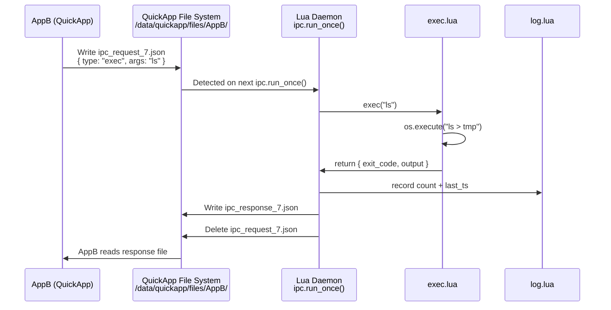
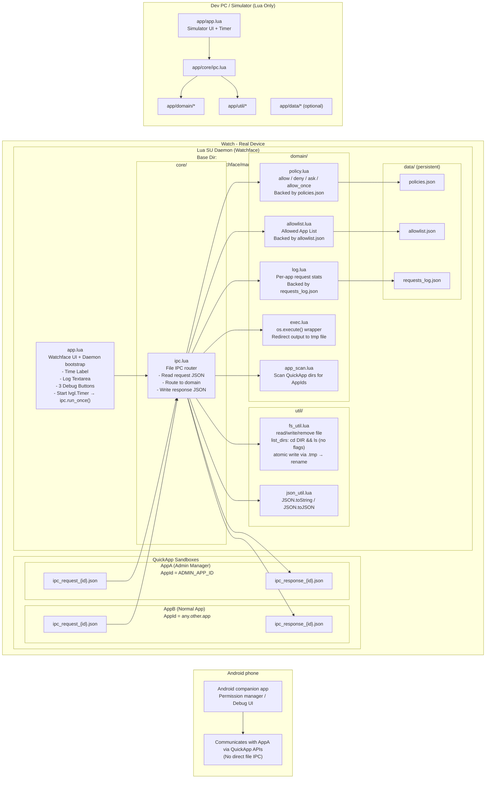
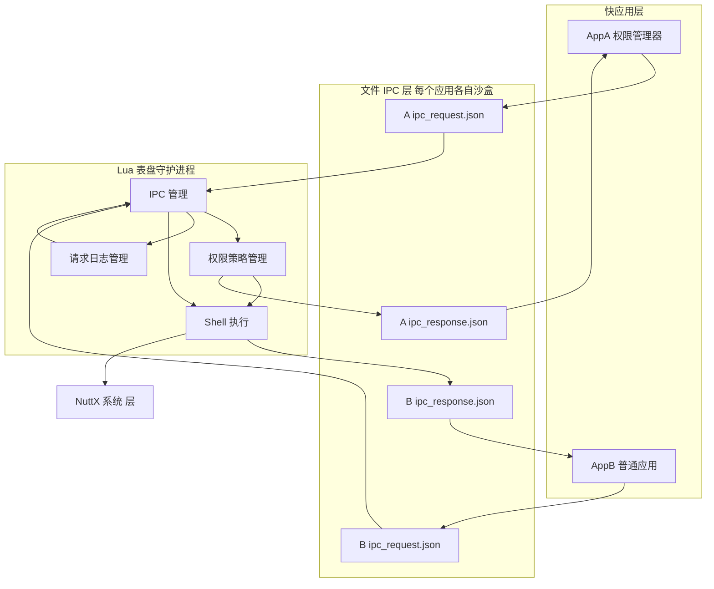

## 项目介绍

Vela-Shell-Bridge 是一个为小米VelaOS穿戴设备设计的 QuickApp → Lua → Shell 执行桥接层。
它允许普通快应用，在严格的权限策略下，通过 Lua 守护进程执行系统级 Shell 命令。

- 文件 IPC 作为通信通道
- Lua 守护进程负责执行与回显
- 支持权限管理、执行日志、白名单
- 可在手表和 PC 模拟器运行

这是一个能让 QuickApp 执行系统命令 的受控提权模块。

## 开发文档

[Lua表盘应用文档](https://github.com/FangAiden/Lua_Watchface_Documentation)
[Vela JS 快应用文档](https://iot.mi.com/vela/quickapp/)

## 流程图

## 架构图1

## 架构图2

