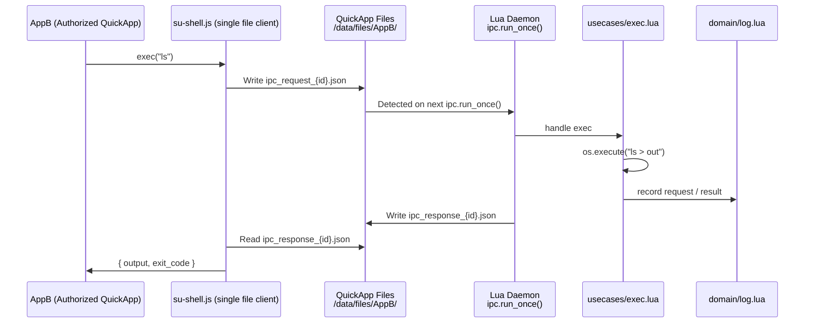
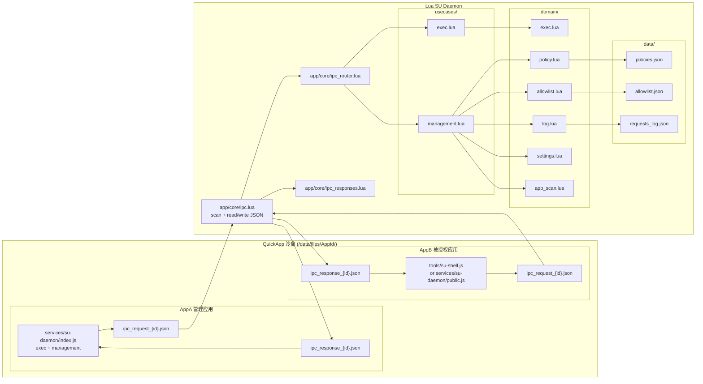
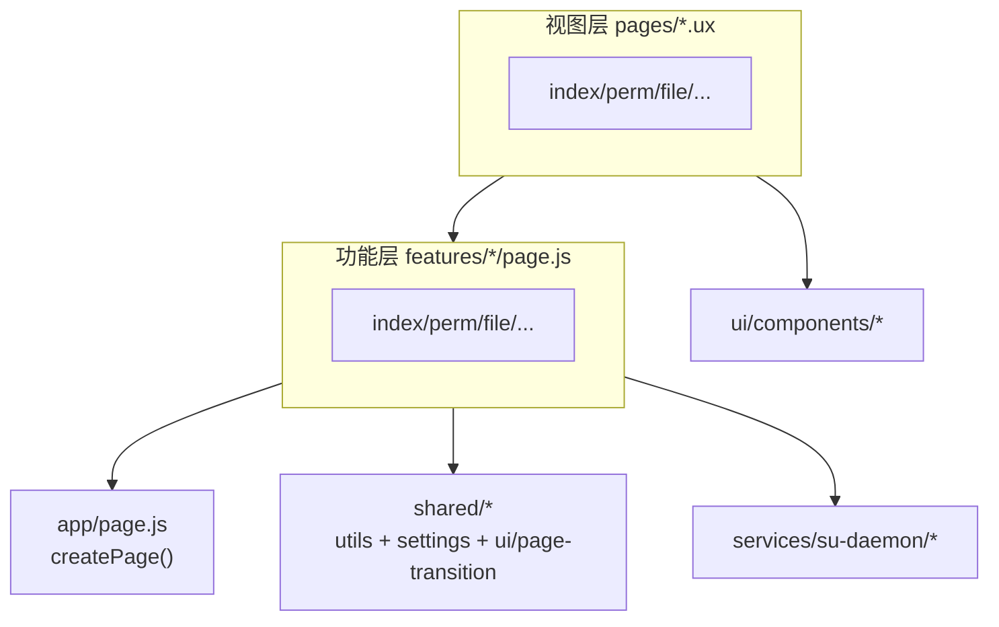

## 项目介绍

Vela-Shell-Bridge 是一个为小米VelaOS穿戴设备设计的 QuickApp → Lua → Shell 执行桥接层。
它允许普通快应用，在严格的权限策略下，通过 Lua 守护进程执行系统级 Shell 命令。

- 文件 IPC 作为通信通道
- Lua 守护进程负责执行与回显
- JS 侧提供 su-daemon 客户端与授权应用单文件脚本
- 支持权限管理、执行日志、白名单
- 可在手表和 PC 模拟器运行

这是一个能让 QuickApp 执行系统命令 的受控提权模块。

## 目标设备 Shell 特性（NuttX / `emulator-5554`）

通过 `adb -s emulator-5554 shell` 实测：目标环境的 `sh` 更接近“精简脚本解释器”，很多常见 shell 特性不可用。

- 支持：换行/`;` 分隔、stdout 重定向 `>`/`>>`、后台 `&`（命令行尾）、`$!`、`if/then/else/fi`
- 不支持：`|`/`||`/`&&`、fd 重定向 `2>`、`grep/head/tail` 等常见工具、常见变量 `$?` `$$` `$1`...
- 注意：`$!` 会在后续命令后变化，必须立即保存；`if` 的条件里不要写 `cmd1; cmd2`（会触发 `echo: not valid in this context`）

因此异步 exec 的完成态 `exit_code` 采用 `-1` 表示“未知”（kill 为 `137`）。同步 exec 仍能返回真实 exit code。

可以用 `tools/probe-shell.ps1` 复现这套探测（默认 `emulator-5554`）。

## 开发文档

[Lua表盘应用文档](https://github.com/FangAiden/Lua_Watchface_Documentation)
[Vela JS 快应用文档](https://iot.mi.com/vela/quickapp/)

## 授权应用接入

被授权应用可直接拷贝 `tools/su-shell.js` 使用 `exec/execSync/kill` 调用 Shell。
主应用使用 `src/services/su-daemon/index.js`（含管理接口），只需 exec 可参考 `src/services/su-daemon/public.js`。

## 手机互联（Interconnect）

本项目已接入 `@system.interconnect`，可以让手机通过 interconnect 消息通道远程调用：

- Shell 执行（并保留工作目录 `cwd` 作为“上下文”）
- 任意路径文件读写（base64 分块传输）

在手表端：进入「设置」页开启 `Interconnect 远程控制`，会生成 6 位配对码（token）。手机端每次请求需携带该 token。

### 快速上手

1) 手表端：打开本应用 → 「设置」→ 开启「Interconnect 远程控制」→ 记下「配对码」
2) 手机端：建立 interconnect 连接（拿到 `conn` 对象，具备 `send()` + `onmessage`）
3) 手机端先发 `hello` 探测是否开启远程控制
4) 远程控制开启后，所有 RPC 请求都需要携带 `token`

> 注意：远程控制默认关闭；开启后等同“远程管理权限”，请妥善保管 token。

### 消息协议（VSB RPC v1）

设备之间通过 interconnect **消息**传递 JSON（对象或字符串均可；本项目的响应一定是 JSON 字符串）。

#### 请求格式

```json
{
  "v": 1,
  "id": "req_1",
  "method": "shell.exec",
  "token": "123456",
  "params": { "cmd": "ls", "sync": true, "timeoutMs": 8000 }
}
```

- `v`: 协议版本（固定 `1`）
- `id`: 请求 ID（建议全局唯一；响应会原样带回）
- `method`: 方法名（见下文）
- `token`: 配对码（远程控制开启后必填；`hello` 不需要）
- `params`: 参数对象（各方法不同）

#### 响应格式

```json
{
  "v": 1,
  "id": "req_1",
  "ok": true,
  "result": { "exitCode": 0, "output": "..." }
}
```

失败时：

```json
{
  "v": 1,
  "id": "req_1",
  "ok": false,
  "error": { "code": "AUTH_FAILED", "message": "Invalid token" },
  "message": "Invalid token"
}
```

常见错误码：

- `REMOTE_DISABLED`：手表端未开启远程控制
- `AUTH_FAILED`：token 不匹配
- `BAD_REQUEST`：参数缺失/非法
- `UNKNOWN_METHOD`：方法不存在
- `INTERNAL_ERROR`：内部异常（如 daemon busy）
- `REPLY_TOO_LARGE`：响应体过大（本项目会截断输出）

### 方法列表

- `hello`
- `shell.exec`
- `shell.getCwd` / `shell.setCwd`
- `fs.stat`
- `fs.read`
- `fs.write`

---

### hello

用途：探测服务端信息（无需 token；即使远程控制未开启也可调用）。

请求：

```json
{ "v": 1, "id": "req_hello", "method": "hello" }
```

响应：

```json
{
  "v": 1,
  "id": "req_hello",
  "ok": true,
  "result": { "server": "VelaShellBridge", "protocol": 1, "remoteEnabled": true, "hasToken": true, "ts": 1700000000000 }
}
```

---

### shell.exec

用途：执行一条 Shell 命令，并返回输出。

#### 关于“上下文”

VelaOS 上每次 `exec` 都是一个新的 `sh -c`，无法像传统终端那样保留完整上下文（变量/函数/alias/管道等）。

本项目提供的“上下文”能力：**保存工作目录 `cwd`**（按 AppId 隔离）。你可以：

- 直接执行 `cd /some/path` 来更新 `cwd`（该命令会被 daemon 拦截，不会启动子进程）
- 后续所有 `shell.exec` 都会在执行前自动 `cd <cwd>`

#### params

- `cmd`（string，必填）：要执行的命令
- `sync`（boolean，可选，默认 `true`）：同步模式能返回真实 `exitCode`；异步模式 exitCode 可能为 `-1`（受 NuttX shell 限制）
- `timeoutMs`（number，可选，默认 `15000`）：整体超时（ms）

请求示例：

```json
{ "v": 1, "id": "req_ls", "method": "shell.exec", "token": "123456", "params": { "cmd": "ls /data", "timeoutMs": 8000 } }
```

响应示例：

```json
{
  "v": 1,
  "id": "req_ls",
  "ok": true,
  "result": { "cmd": "ls /data", "mode": "sync", "exitCode": 0, "output": "...", "cwd": "/data" }
}
```

`cd` 示例：

```json
{ "v": 1, "id": "req_cd", "method": "shell.exec", "token": "123456", "params": { "cmd": "cd /data/quickapp" } }
```

---

### shell.getCwd / shell.setCwd

用途：直接读/写 daemon 记录的 `cwd`。

```json
{ "v": 1, "id": "req_getcwd", "method": "shell.getCwd", "token": "123456" }
```

```json
{ "v": 1, "id": "req_setcwd", "method": "shell.setCwd", "token": "123456", "params": { "cwd": "/data" } }
```

---

### fs.stat

用途：查询文件/目录是否存在、是否为目录、文件大小。

请求：

```json
{ "v": 1, "id": "req_stat", "method": "fs.stat", "token": "123456", "params": { "path": "/data/apps.json" } }
```

响应：

```json
{ "v": 1, "id": "req_stat", "ok": true, "result": { "path": "/data/apps.json", "exists": true, "is_dir": false, "size": 12345 } }
```

---

### fs.read（base64 分块下载）

用途：从任意路径读取文件内容（二进制安全，适合传输大文件）。

#### params

- `path`（string，必填）
- `offset`（number，可选，默认 `0`）
- `length`（number，可选，默认 `2048`，最大 `32768`）
- `encoding`（string，可选，固定 `base64`）

请求：

```json
{ "v": 1, "id": "req_read_0", "method": "fs.read", "token": "123456", "params": { "path": "/data/apps.json", "offset": 0, "length": 4096, "encoding": "base64" } }
```

响应：

```json
{
  "v": 1,
  "id": "req_read_0",
  "ok": true,
  "result": { "path": "/data/apps.json", "encoding": "base64", "offset": 0, "next_offset": 4096, "eof": false, "size": 12345, "data": "...." }
}
```

---

### fs.write（base64 分块上传）

用途：向任意路径写入文件内容（支持覆盖/追加）。

#### params

- `path`（string，必填）
- `data`（string，必填）：base64 字符串
- `mode`（string，可选）：`truncate`（覆盖写）或 `append`（追加写，默认）
- `encoding`（string，可选，固定 `base64`）

示例：写入（覆盖）一个文本文件：

```json
{ "v": 1, "id": "req_write_0", "method": "fs.write", "token": "123456", "params": { "path": "/tmp/hello.txt", "mode": "truncate", "encoding": "base64", "data": "aGVsbG8K" } }
```

响应：

```json
{ "v": 1, "id": "req_write_0", "ok": true, "result": { "path": "/tmp/hello.txt", "bytes": 6, "mode": "truncate" } }
```

---

### 例子：手机端最小 RPC 封装（伪代码）

手机侧 interconnect SDK/API 形态可能不同，但通常都有类似：

- `conn.send({ data: <string|object> })`
- `conn.onmessage = (evt) => { /* evt.data */ }`

下面示例仅演示“按 id 匹配响应”的用法：

```js
function makeId() {
  return `req_${Date.now()}_${Math.floor(Math.random() * 100000)}`;
}

function createRpc(conn) {
  const pending = new Map();

  conn.onmessage = (evt) => {
    const msg = (typeof evt.data === "string") ? JSON.parse(evt.data) : evt.data;
    const p = pending.get(msg.id);
    if (!p) return;
    pending.delete(msg.id);
    if (msg.ok) p.resolve(msg.result);
    else p.reject(new Error(msg.message || (msg.error && msg.error.message) || "RPC error"));
  };

  function call(method, params, token, timeoutMs = 15000) {
    const id = makeId();
    const req = { v: 1, id, method, token, params };

    return new Promise((resolve, reject) => {
      const t = setTimeout(() => {
        pending.delete(id);
        reject(new Error(`timeout: ${method}`));
      }, timeoutMs);

      pending.set(id, {
        resolve: (v) => { clearTimeout(t); resolve(v); },
        reject: (e) => { clearTimeout(t); reject(e); },
      });

      conn.send({ data: JSON.stringify(req) });
    });
  }

  return { call };
}
```

### 例子：远程执行 Shell（带 cwd）

```js
const rpc = createRpc(conn);
const token = "123456";

await rpc.call("hello", null, null, 3000);
await rpc.call("shell.exec", { cmd: "cd /data/quickapp" }, token);
const r = await rpc.call("shell.exec", { cmd: "ls", timeoutMs: 8000 }, token);
console.log(r.exitCode, r.cwd, r.output);
```

### 例子：下载文件（fs.read 循环直到 eof）

```js
const rpc = createRpc(conn);
const token = "123456";

let offset = 0;
const parts = [];
while (true) {
  const r = await rpc.call("fs.read", { path: "/data/apps.json", offset, length: 8192, encoding: "base64" }, token);
  // 重要：r.data 是“该分块”的 base64，不要 chunks.join("") 后一次性解码；
  // 应当逐块解码成 bytes，再拼接 bytes。
  parts.push(base64DecodeToBytes(r.data));
  offset = r.next_offset;
  if (r.eof) break;
}

// bytes = concatBytes(parts);
```

Node.js 参考实现：

```js
const parts = [];
let offset = 0;
while (true) {
  const r = await rpc.call("fs.read", { path: "/data/apps.json", offset, length: 8192, encoding: "base64" }, token);
  parts.push(Buffer.from(r.data, "base64"));
  offset = r.next_offset;
  if (r.eof) break;
}
const bytes = Buffer.concat(parts);
```

### 例子：上传文件（truncate + append 分块写入）

```js
const rpc = createRpc(conn);
const token = "123456";

// 假设 bytes 是 Uint8Array/byte[]（按你的语言环境获取）
const bytes = getBytesSomehow();

const CHUNK_BYTES = 8 * 1024; // 建议按“字节”分块，再对每块做 base64
let first = true;
for (let i = 0; i < bytes.length; i += CHUNK_BYTES) {
  const chunk = bytes.slice(i, i + CHUNK_BYTES);
  const b64 = base64EncodeBytes(chunk);

  await rpc.call("fs.write", {
    path: "/tmp/upload.bin",
    encoding: "base64",
    mode: first ? "truncate" : "append",
    data: b64
  }, token, 12000);

  first = false;
}
```

Node.js 参考实现：

```js
const fs = require("node:fs");
const bytes = fs.readFileSync("./upload.bin");

const CHUNK_BYTES = 8 * 1024;
let first = true;
for (let i = 0; i < bytes.length; i += CHUNK_BYTES) {
  const chunk = bytes.subarray(i, i + CHUNK_BYTES);
  const b64 = chunk.toString("base64");
  await rpc.call("fs.write", {
    path: "/tmp/upload.bin",
    encoding: "base64",
    mode: first ? "truncate" : "append",
    data: b64
  }, token, 12000);
  first = false;
}
```

## 流程图



## 架构图1（系统）



## 架构图2（JS 侧）


